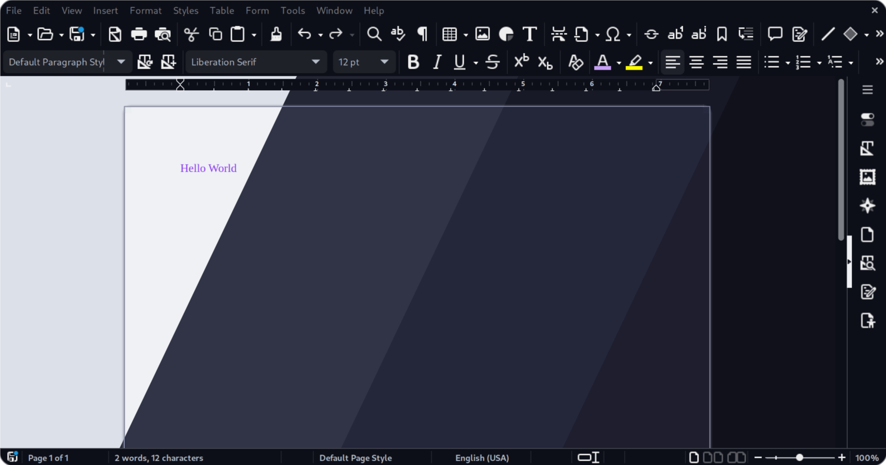
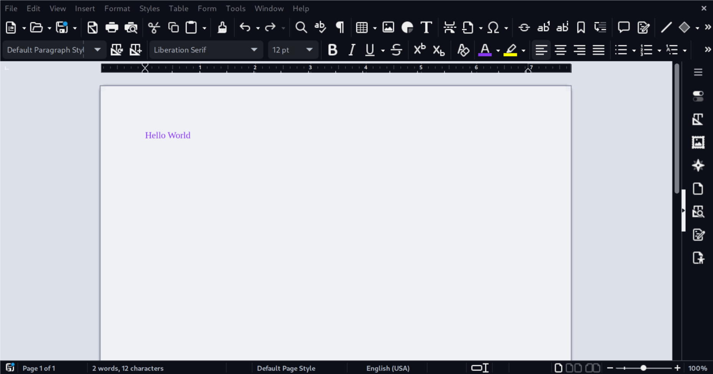
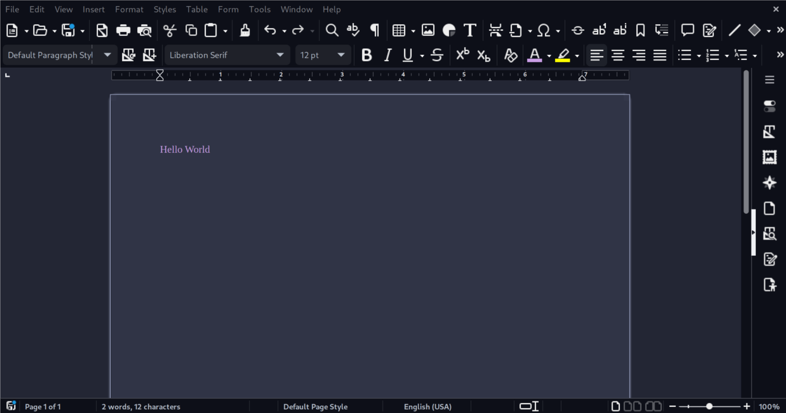
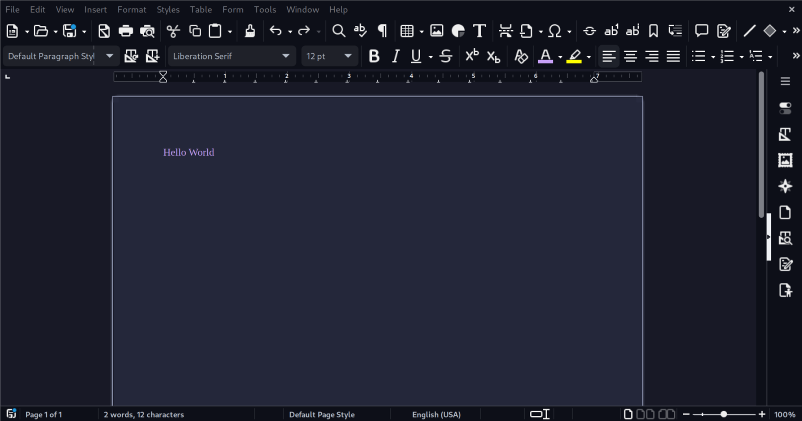
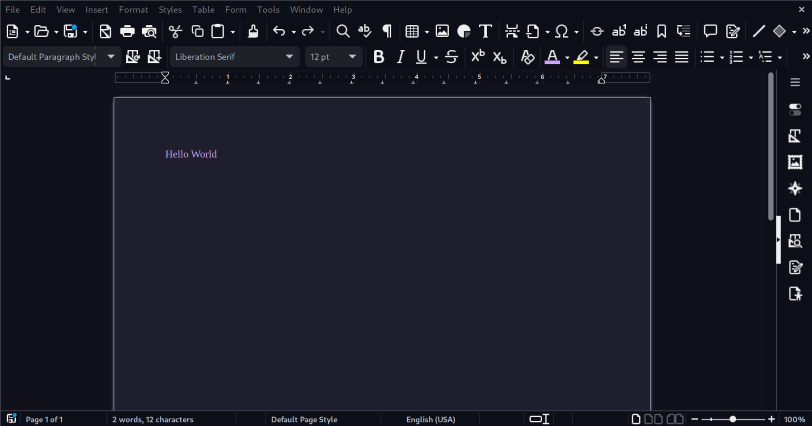

<h3 align="center">
	 
	
	Catppuccin for <a href="https://github.com/catppuccin/libre-office">LibreOffice</a>
	
</h3>

	
	
	

	

## Previews

🌻 Latte

🪴 Frappé

🌺 Macchiato

🌿 Mocha

## Usage

### Color palette
To install the .soc file follow the steps per os

#### Linux

Copy the `.soc` file you want to `${XDG_CONFIG_HOME:-$HOME/.config}"/libreoffice/*/user/config/`

#### Windows

Copy the `.soc` file you want to `$HOME/AppData/Roaming/LibreOffice"/*/user/config/`

#### Mac

Copy the `.soc` file you want to `$HOME/Library/Application Support/LibreOffice"/*/user/config/`

### Application Colours
*note: applies to macos/linux only* 

> [!WARNING]
> This will overwrite your main config for libre office and back it up before it does.

run script: `bash scripts/install_theme.sh themes/flavor/accent/catppuccin-flavor-accent.xcu`
replace variables `flavor`, `accent` with correct values.
<!-- The FAQ section is optional. Remove if needed.-->
<!--
## 🙋 FAQ

- Q: **_"How can I do X?"_**\
  A: ... -->

## 💝 Thanks to

- [NeonGamerBot](https://github.com/NeonGamerBot-QK)
- [dracula/libreoffice](https://github.com/dracula/libreoffice)

&nbsp;

	

	Copyright &copy; 2021-present <a href="https://github.com/catppuccin" target="_blank">Catppuccin Org</a>

	

